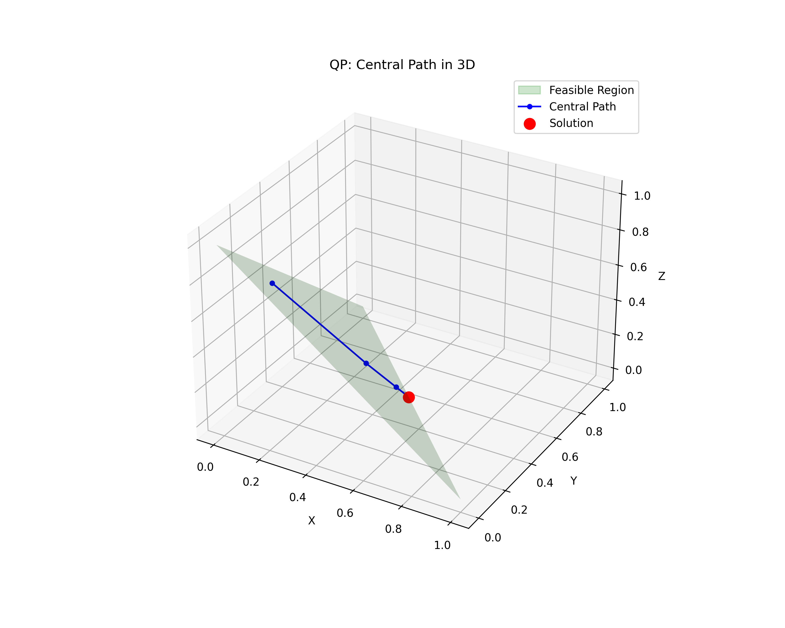

# Interior Point Optimization Assignment

As part of the Numerical Optimization In Python course, This repository contains my implementation and submission of the interior-point method for solving constrained optimization problems. The implementation supports both linear and quadratic objective functions with linear equality and inequality constraints.

## Requirements

To install the required dependencies, run:

```bash
pip install -r requirements.txt
```

This will install the following packages:

- numpy (version 1.20.0 or higher)
- matplotlib (version 3.5.0 or higher)

## Running the Tests

There are two ways to run the tests:

### Option 1: Using run_tests.py

```bash
python run_tests.py
```

This script will execute all the tests and generate plots in the `output` directory.

### Option 2: Using the Command Line

```bash
python -m unittest tests.test_constrained_min
```

## Examples

The code includes two test examples:

### Quadratic Programming (QP)

A 3D quadratic optimization problem with equality and inequality constraints:

$$
\min_{x,y,z} x^2 + y^2 + (z+1)^2 \\
\text{subject to: } x + y + z = 1 \\
x \geq 0, y \geq 0, z \geq 0
$$

### Linear Programming (LP)

A 2D linear optimization problem with inequality constraints:

$$
\max_{x,y} x + y \\
\text{subject to: } y \geq -x + 1 \\
y \leq 1 \\
x \leq 2 \\
y \geq 0
$$

## Results

### Numerical Results

#### QP Results

```
Final x: [5.00000000e-01 5.00000000e-01 4.43771367e-10]
Objective: 1.500000
Constraints: x+y+z = 1.000000, x≥0: True, y≥0: True, z≥0: True
```

#### LP Results

```
Final x: [2. 1.]
Objective (max): 3.000000
Constraints:
  y ≥ -x+1: True
  y ≤ 1: True
  x ≤ 2: True
  y ≥ 0: True
```

### Visualizations

The code generates the following visualizations:

### Quadratic Programming (QP)

#### Central Path in 3D



The plot shows the central path of the interior point method for the quadratic programming problem in 3D.

- Green triangle: The feasible region (the standard simplex in 3D)
- Blue line: The central path followed by the algorithm
- Red dot: The solution

#### Objective Value History


This plot shows how the objective value changes with each outer iteration of the interior point method for the quadratic programming problem.

### Linear Programming (LP)

#### Central Path in 2D


The plot shows the central path of the interior point method for the linear programming problem in 2D.

- Green area: The feasible region defined by the constraints
- Blue line: The central path followed by the algorithm
- Red dot: The solution

#### Objective Value History


This plot shows how the objective value changes with each outer iteration of the interior point method for the linear programming problem.

## Implementation Details

The interior point method implementation includes:

- Barrier function transformation of inequality constraints
- Newton's method for the inner optimization loop
- Backtracking line search for step size selection
- Primal-dual approach for handling equality constraints

### Algorithm Overview

The interior point method works by:

1. Converting the original constrained problem into a sequence of unconstrained problems using a barrier function
2. Applying Newton's method to minimize each unconstrained problem
3. Following the central path to the optimal solution by gradually increasing the barrier parameter

The implementation uses a logarithmic barrier function and implements both equality and inequality constraint handling. The barrier parameter is adjusted in the outer loop while Newton's method is applied in the inner loop to follow the central path to optimality.

### Key Components

1. **BarrierFunction Class**:

   - Transforms the original problem by adding logarithmic barrier terms for inequality constraints
   - Computes the modified objective function, gradient, and Hessian

2. **InteriorPoint Class**:
   - Manages the outer iterations by adjusting the barrier parameter
   - Handles equality constraints through a primal-dual approach
   - Uses backtracking line search to ensure feasibility and sufficient decrease
   - Implements Newton's method to solve the inner minimization problems

The algorithm tracks the central path from an initial feasible point to the optimal solution, gradually reducing the influence of the barrier terms until convergence.
